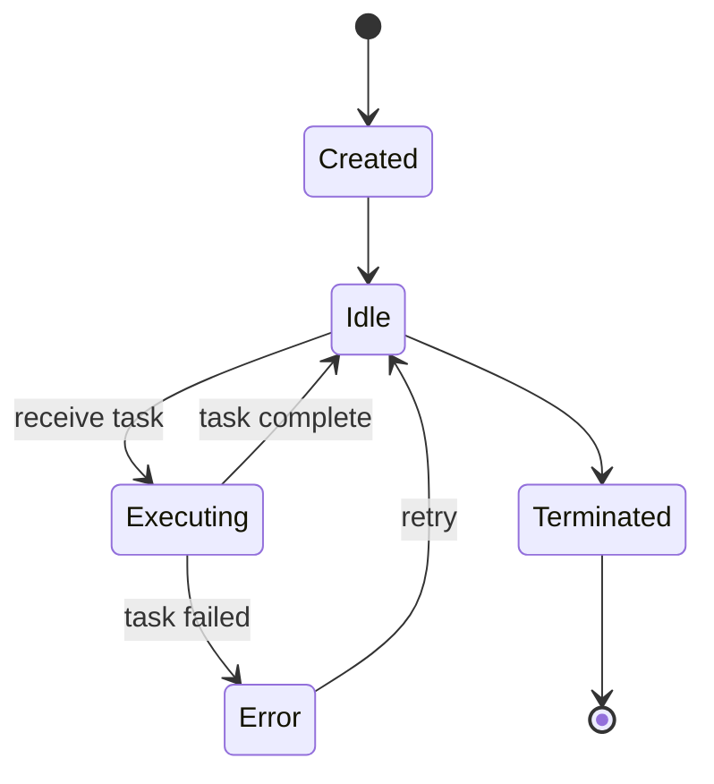

# docs/concepts.md

# Core Concepts

## Agents

Agents are autonomous entities that can:
- Execute tasks using LLMs
- Use tools to interact with external systems
- Collaborate with other agents
- Maintain context and memory

```python
agent = Agent(
    name="DataAnalyst",
    role="Senior Data Analyst",
    goal="Provide insights from data",
    backstory="You are an expert in statistical analysis...",
    model="gpt-4",
    temperature=0.7,
    tools=[...],
    max_iterations=5
)
```

### Agent Lifecycle



## Tasks

Tasks define work for agents:

```python
task = Task(
    description="Analyze sales data for Q4",
    expected_output="Detailed report with charts",
    agent=analyst_agent,
    tools_to_use=["data_analyzer", "chart_generator"],
    context=["Previous Q3 report", "Company goals"]
)
```

## Tools

Tools extend agent capabilities:

```python
from litecrewai import Tool

class EmailSender(Tool):
    name = "email_sender"
    description = "Send emails"
    
    async def execute(self, to: str, subject: str, body: str):
        # Implementation
        return f"Email sent to {to}"
```

## Crews

Crews orchestrate multi-agent workflows:

```python
crew = Crew(
    agents=[agent1, agent2, agent3],
    tasks=[task1, task2, task3],
    process=ProcessType.SEQUENTIAL,  # or PARALLEL
    memory=True,  # Enable shared memory
    cache=True,   # Enable result caching
    callbacks={
        "on_task_complete": my_callback
    }
)
```